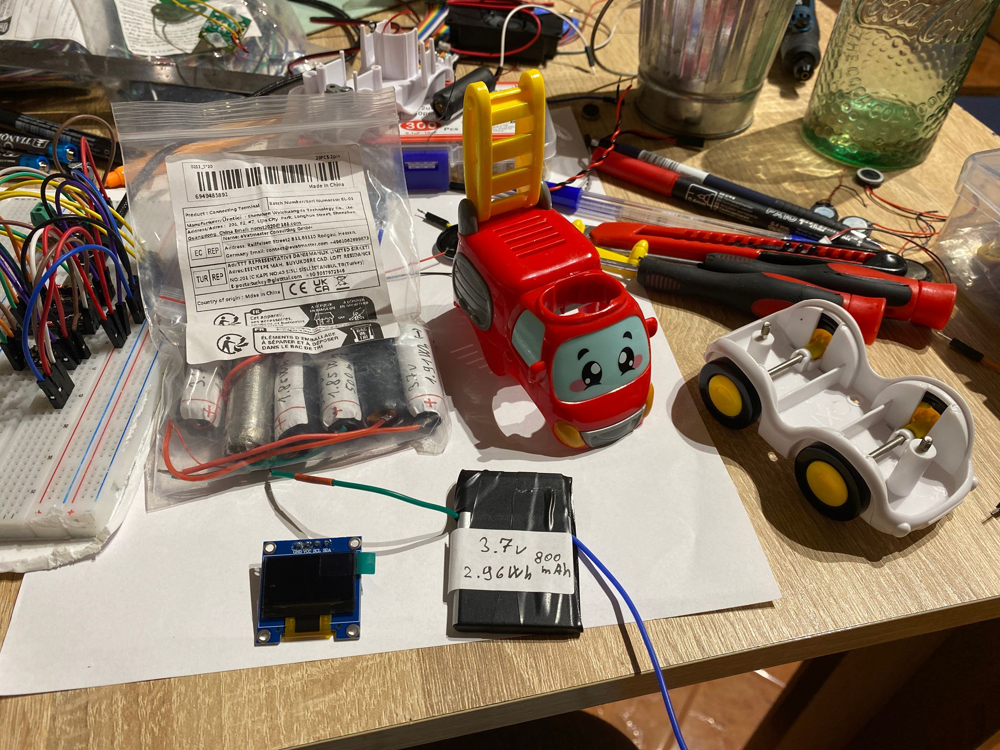
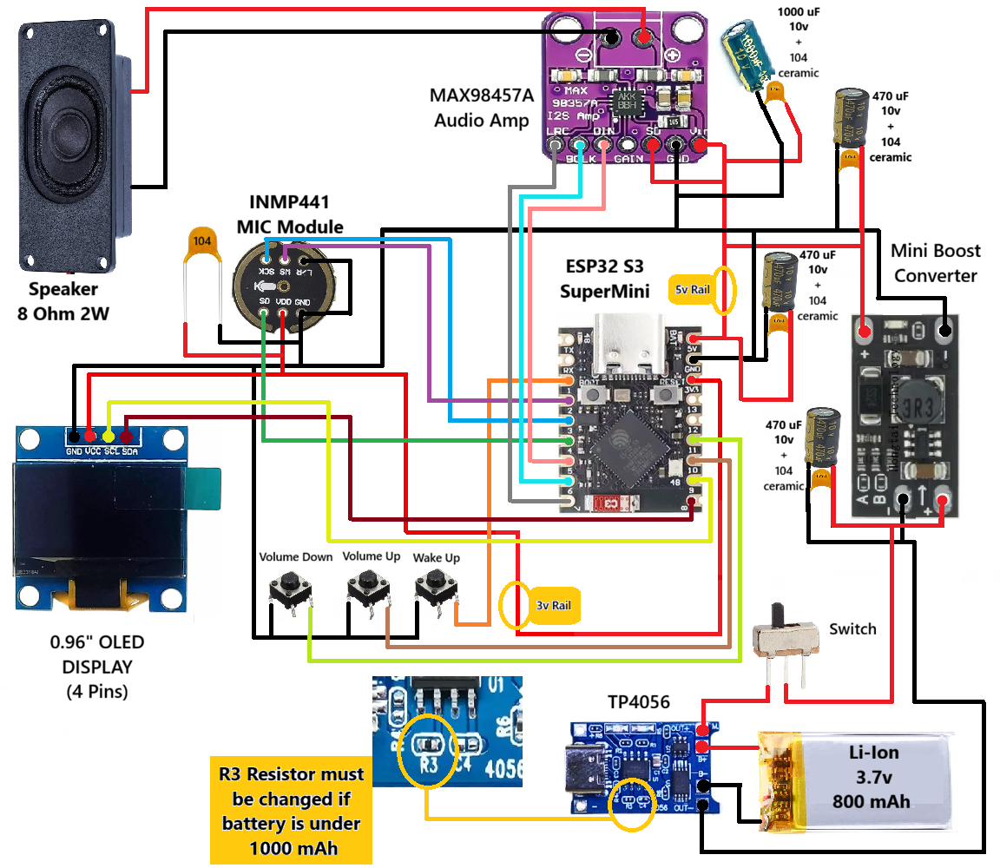
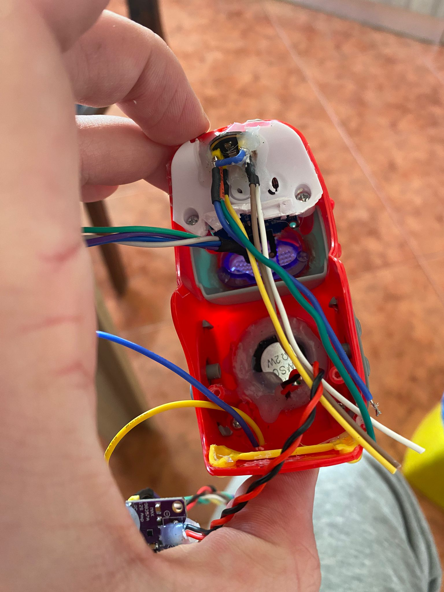
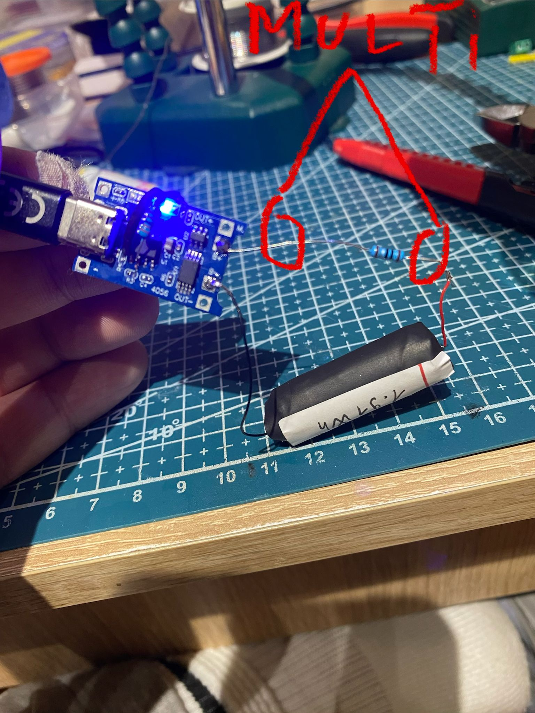
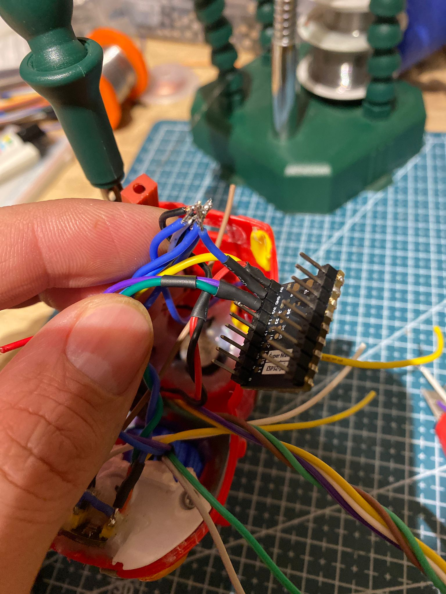
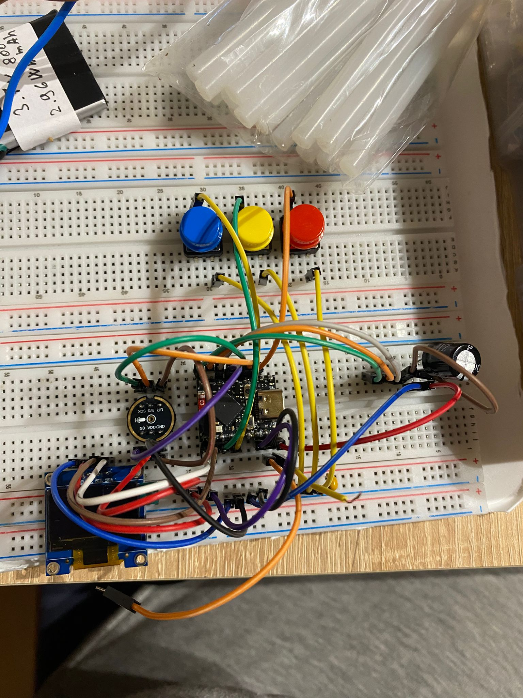

# AIChatBot Firetruck

[---]

# ESP32-S3 Voice Assistant using Xiaozhi API 

A compact, battery-powered AI voice assistant built inside a firetruck chassis using an ESP32-S3 Supermini, I2S microphone INMP441 , I2S amplifier MAX98357A ,0.96" OLED display , boost converter from 3.7v to 5v, a li-Ion battery 3.7v 800 mAh, TP4056 Charging module and a properly decoupled mixed digital/audio power system. AI Models used Xiaozhi Lite, DeepSeek Quantized, DauBao 2.0

[---]

# Project Overview

This project is a fully functional voice chatbot built around:

* ESP32-S3 Supermini
* INMP441 I2S digital microphone
* MAX98357A I2S audio amplifier
* 0.96” OLED (I2C) -> (When searching do check for display to have **4** pins not 8)
* TP4056 Li-Ion charger (modified to 200mA)
* Samsung 3.7V 800mAh Li-Ion battery -> (You can use any space battery you have with good health)
* Boost converter set to 5V
* Proper decoupling & star-ground topology

This build focuses on:

* Stable power delivery
* Audio clarity
* WiFi reliability
* Professional grounding
* Clean enclosure integration
* Proof of concept for a toy integrated AIChatBot

It may look so but this is not a “toy project”. It is a properly engineered, compact mixed-signal embedded system.

[---]

# What You Need with AliExpress Links

## Mandatory Components

* ESP32-S3 Supermini                            -> Link : https://shorturl.at/zLChx
* INMP441 microphone                            -> Link : https://shorturl.at/EX8jN
* MAX98357A amplifier                           -> Link : https://shorturl.at/SnJsn
*Ceramic Capacitors (104)                       -> Link : https://shorturl.at/riOb9
* Electrolytic Capacitors Kit                   -> Link : https://shorturl.at/HwgME
* TP4056 charging module                        -> Link : https://shorturl.at/miefV
* Resistor Kit (adjusted for 200mA charging)    -> Link : https://shorturl.at/NT6mV
* Boost converter (3.7V → 5V)                   -> Link : https://tinyurl.com/4dsx7dfj
* 3.7V Li-Ion battery (800mAh used here)        -> Link : https://tinyurl.com/yyrns89w 
* 0.96” OLED (SSD1306 I2C)                      -> Link : https://tinyurl.com/y2un2hme
* 4-8 Ω  2W speaker                             -> Link : https://tinyurl.com/zsnsfz8t or https://tinyurl.com/299k8ejv

[---]

## Optional but Recommended

* Heat shrink tubing
* Silicone glue for vibration resistance
* Multimeter (mandatory for voltage tuning)

[---]

# Power Architecture

[---]

**Advice: Please note that the capatiors marked 470uF/1000uF + 104 are 2 different capacitors soldered together**

## Capacitors Used

| Location     | Value         | Purpose                |
| ------------ | ------------- | ---------------------- |
| Battery Rail | 470µF + 100nF | Input stabilization    |
| Boost Output | 470µF + 100nF | Switching smoothing    |
| MAX98357A    | 470µF + 100nF | Audio spike absorption | -> o.1
| ESP32 Rail   | 470µF + 100nF | WiFi burst buffering   |

**Legend: 470µF are Electrolytic Capacitors 10v or max 16v and 100nF are Ceramic 104 Capacitors**
*o.1 -> You can up 470µF to 680-1000 µF if module stops randomly*

[---]

### Why This Works

* Input cap stabilizes battery
* Boost output cap smooths switching
* MAX cap absorbs audio spikes
* ESP32 cap handles WiFi bursts
* Star ground prevents ground noise

This is a properly decoupled mixed digital/audio system.

[---]

# Star Grounding Strategy

All grounds meet at a single central node.

Audio ground is not daisy-chained through digital ground.
Boost return is isolated from mic return.

This prevents:

* Digital ticking in speaker
* Mic noise under WiFi load
* Brownouts during audio peaks

[---]

# Boost Converter Setup (Set to 5V)

Before connecting ESP32:

1. Power boost converter from battery.
2. Use multimeter on output.
3. Adjust potentiometer until output reads exactly **5.00V**.

Never connect ESP32 before verifying output voltage.

[---]

# IMNP441 Mic Module Testing Code via Arduino and 1x ESP32 (any variant)

You can use the code below to test your mic modeule. I have found that some IMNP441 modules especially cheap ones come with re-used ICs or lasered-off serials so there threshold starts from 1000 in a silent room. On a good module it starts around 100 if silentce and jumps to 1500-2000+ if you speak in the MIC from 20cm.

**Drop in Arduino and flash on the ESP32 via USB. Do not forget to keep pressing "Boot" button until it shows "UPLOADING" then release. Some boards need to be pressed some not.**

[--Test Code Below--]

#include <driver/i2s.h>

/*
INMP441 (I2S mic) sensitivity test

What you change per board:
- Only the three pin defines below (I2S_WS, I2S_SD, I2S_SCK).
- Everything else can stay the same.

Wiring reminder (INMP441 -> ESP32):
- VDD  -> 3.3V
- GND  -> GND
- SCK  -> I2S_SCK  (BCLK)
- WS   -> I2S_WS   (LRCLK / WS)
- SD   -> I2S_SD   (DATA OUT from mic)
- L/R  -> GND      --> forces LEFT channel (matches I2S_CHANNEL_FMT_ONLY_LEFT)

If you set L/R to 3.3V (RIGHT channel), then change:
  .channel_format = I2S_CHANNEL_FMT_ONLY_RIGHT;   --> Change to RIGHT
or read both channels (more advanced).
*/

// --> Change to the GPIO you actually wired on THIS board:
#define I2S_WS   25   // LRCLK / WS pin from mic
#define I2S_SD   33   // DATA pin from mic
#define I2S_SCK  26   // BCLK / SCK pin from mic

/*
Board notes (choose any free GPIOs, then set the defines above):

ESP32-WROOM-32 (30-pin / 38-pin):
- Almost any normal GPIO works.
- Avoid GPIOs 6-11 (used by flash).
- Good safe choices: 25, 26, 33 (as shown).

ESP32-S3 SuperMini:
- You must use GPIO numbers that exist on your S3 board and are broken out.
- Avoid pins reserved/used for USB, flash/PSRAM, or not exposed on the module.
- Pick three available GPIOs on the SuperMini and set them in the defines above.
*/

void setup() {
  Serial.begin(115200);
  delay(1000);

  i2s_config_t i2s_config = {
    .mode = (i2s_mode_t)(I2S_MODE_MASTER | I2S_MODE_RX),
    .sample_rate = 16000,
    .bits_per_sample = I2S_BITS_PER_SAMPLE_32BIT,
    .channel_format = I2S_CHANNEL_FMT_ONLY_LEFT,      // --> Change to ONLY_RIGHT if L/R is tied to 3.3V
    .communication_format = I2S_COMM_FORMAT_STAND_I2S, // If this fails to compile on some cores: --> Change to I2S_COMM_FORMAT_I2S
    .intr_alloc_flags = 0,
    .dma_buf_count = 4,
    .dma_buf_len = 256,
    .use_apll = false
  };

  i2s_pin_config_t pin_config = {
    .bck_io_num = I2S_SCK,             // --> Change via the define above
    .ws_io_num = I2S_WS,               // --> Change via the define above
    .data_out_num = I2S_PIN_NO_CHANGE, // Mic test is RX only
    .data_in_num = I2S_SD              // --> Change via the define above
  };

  i2s_driver_install(I2S_NUM_0, &i2s_config, 0, NULL);
  i2s_set_pin(I2S_NUM_0, &pin_config);

  Serial.println("Mic test started...");
}

void loop() {
  int32_t sampleBuffer[256];
  size_t bytesRead;

  i2s_read(I2S_NUM_0, &sampleBuffer, sizeof(sampleBuffer), &bytesRead, portMAX_DELAY);

  int32_t maxVal = 0;
  for (int i = 0; i < 256; i++) {
    // INMP441 delivers 24-bit audio in a 32-bit frame.
    // Shift right to make the printed numbers easier to compare between modules.
    int32_t val = abs(sampleBuffer[i] >> 14);
    if (val > maxVal) maxVal = val;
  }

  // Interpretation:
  // - Quiet room: low numbers (often ~50-200 on a "good" module).
  // - Speaking near mic: thousands.
  Serial.println(maxVal);
}

[-Test Code Above-]

# TP4056 Resistor Modification (200mA Charging)

*This step is only needed if you will use a battery that has a smaller capacity then 1000 mAh since default boards come with 1A charging current and can overheat some batteries!*

*If not using a tiny battery or you have a TP4056 set to 500mAh charge you can skip this part*

The TP4056 R3 resistor controls charging current.

Stock modules often charge at 1A — too high for 800mAh cell.

--> *Please read this before starting to work on R3 Resistor* <--

--> *First check in continuity mode the 2 pads of the R3 resitor with the IC legs or the IN/OUT pads to confirm what pad goes where.* <--

The tiny pads on the R3 SMD resistor cannot be re-soldered with a normal soldering iron and we will be using only 1 of the pads.
In order to change the R3 Resistor to a good one we will need to check after if the change worked. We desolder the tiny R3 SMD resitor and solder 1 end of our resistor to any of the 2 small pads. Do not bridge the 2 tiny pads! It can short the board. after we soldered 1 pin of our choosen resistor we need to check if we soldered the it correctly. We can do that using a multimeter in *continuity mode* and check where R3 pads connect. After we soldered 1 tiny pad we can solder the resistors other leg to the IC's leg.

Battery (Red)   +  -> Resistor(1.1Ω) -> TP4056 B+ 
Battery (Black) -  -> TP4056 B-

After that we will add 1x resitor in series with the battery to check if it charges at .200 Amperes or what we set it to. 
We modified R3 to limit charging to ~200mA.

Formula:

[---]

I_charge = 1000V / R3 (kΩ)

With R = 1.1Ω it becomes:

0.11V → 0.10A (100mA)
0.165V → 0.15A (150mA)
0.22V → 0.20A (200mA)
0.275V → 0.25A (250mA)
0.33V → 0.30A (300mA)

[---]

For ~200mA, use ~5kΩ equivalent.

Common Values:
10kΩ → ~120mA
6.8kΩ → ~176mA
5.6kΩ → ~214mA -> Sweet Spot
5.1kΩ → ~235mA -> Sweet Spot
4.7kΩ → ~255mA -> Sweet Spot
3.9kΩ → ~308mA -> Sweet Spot
3.3kΩ → ~364mA
2.7kΩ → ~444mA
2.4kΩ → ~500mA
2.2kΩ → ~545mA
2.0kΩ → ~600mA
1.5kΩ → ~800mA
1.2kΩ → ~1000mA

This protects:

* Battery lifespan
* Thermal stability
* Safety inside enclosure

[---]

# Wiring Best Practices

* Twist all power wires (VCC + GND pairs)
* Twist speaker wires
* Keep I2S lines short
* Keep boost converter physically separated from microphone

Twisting wires reduces:

* EMI
* Switching noise
* Audio interference

---

# Breadboard Version

Before sealing inside chassis, build and test on breadboard.

Test for:

* WiFi stability
* Audio playback
* Mic input clarity
* No brownouts under load

*Never seal a system you haven’t tested outside enclosure.*

---

# Xiaozhi API Integration

This project uses the Xiaozhi API for AI chat functionality.
The project is using **TanDev's** Flasher and Text-to-Speech backend so all credits are going for him for letting me use his flasher

All credits for AI backend and conversational engine go to:  

https://xiaozhi.me/login?redirect=/console/agents

https://tandev.click

This project integrates the API but does not claim ownership of the service. All services and credits regarding AI Agents go to Xiaozhi AI Team, DeepSeek AI Team.

Users must:

* Register with Xiaozhi
* Obtain API credentials
* Configure WiFi + API keys in firmware
* Configure Agent as pleased
* Re-flash Online, if connected you can directly change the settings.

---

# How to Flash the ESP32

You need to visit: https://tandev.click and flash the ESP32-S3 with the "Chatbot" firmware so the backend will be connected

1. Connect ESP32-S3 via USB.
2. Select correct S3 version of the flasher
3. Select correct COM port.
4. Flash firmware.
5. Restart the ESP32

If boot fails:

* Hold BOOT button during flashing.

---

# How to Register & Configure

1. Create Xiaozhi account.
2. Generate API key on the ESP32 screen.
3. Insert credentials into webpage to register device.
4. Flash updated firmware.
5. Restart device.

[---]

# Audio System

INMP441 → I2S → ESP32
ESP32 → I2S → MAX98357A → Speaker

Fully digital audio path.

No analog mic preamp required.

[---]

# Lessons Learned

* Bulk capacitance matters. (Always solder capacitors directly ON module pins and sometimes INLINE)
* Star grounding matters even more. Especially as close as possible to MAIN power Rail e.g. Buck OUT pins, short wires
* Boost converters need proper smoothing in audio systems. Some modules have high sudden drain so they need capacitors for sudden spikes 
* Charging current must match battery capacity. Never Charge small batteries 400 mAh with e.g. 1A, it will overheat or enev blow up on you!
* Twisted wiring significantly reduces interference. Always twist GND and VCC together to cancel any EMI it might pick up
* Mixed digital/audio systems require intentional layout.

[---]
I hope you enjoyed this project as well as me and you could finish it succesfully. ^_^
# Built and Designed by ***BotyB***
