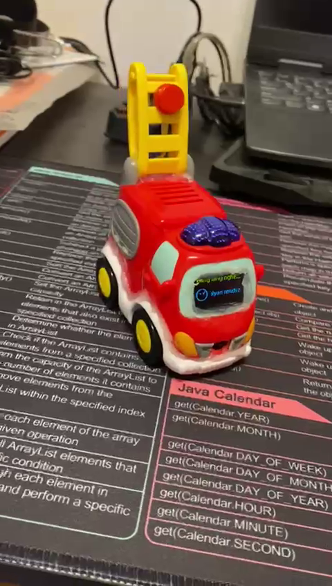

# AIChatBot

An AIChatBot made with an ESP32-S3 SuperMini from a toy that uses Text-to-Speech to talk back to the user
In this project i use an ESP32-S3, an IMNP441 Mic module, a MAX98357A Audio Amp, a 0.96 inch OLED display, a mini boost converter module, a TP4056 for charging, a 3.7 Li-Ion 800 mAh battery
The pinout is displayed in the images as well as the TP4056 R3 resistor that needs to be changed if the battery is smaller then 1000 mAh since default charge is 1A so it can overheat the battery.
